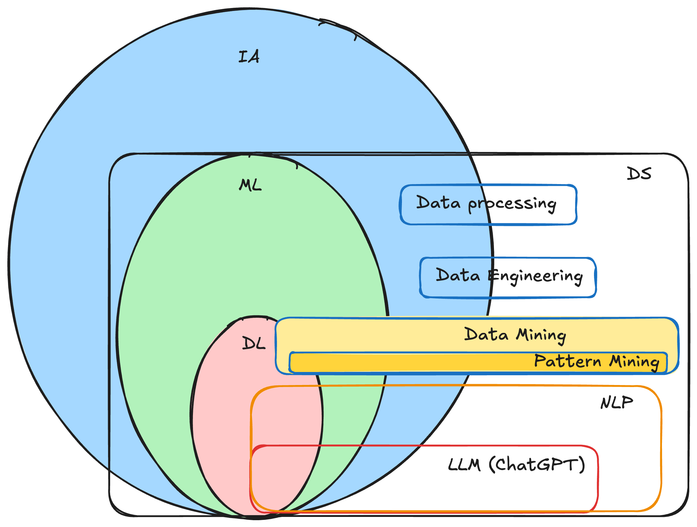

.. _part1_chap1:

***********************************************************************
Chapitre 1 : Introduction au data mining
***********************************************************************

Le **data mining** (fouille de données) est la **recherche/découverte de
connaissances ou d'informations utiles, souvent cachées**, dans les données.

Objectifs
=========

À la fin de ce chapitre, vous devez pouvoir :

- Définir donnée, information et data mining
- Situer le DM par rapport à l'IA, au ML, au DL et à la science des données
- Définir le *pattern mining* et ses variantes
- Distinguer les grandes tâches : clustering, classification, régression, détection d'anomalies
- Citer des applications

1. Donnée, information, connaissance
====================================

- **Donnée** = unité d'information ; **l'information** est la partie *utile* de la
  donnée (la notion d'utilité est subjective : utile pour la **prise de décision**).
- **Faire du data mining**, c'est extraire des informations (notamment **cachées**)
  des données, pour appuyer une décision (rentabilité, bien-être, etc.).
- **Science des données** : la science qui permet d'**étudier**, **traiter** et
  **utiliser** les données comme base de décision. Sources : réseaux sociaux, IoT,
  sites web/API, enquêtes et bases de production, …

2. IA, ML, DL, DS
=================

- **IA** : un système capable de (1) simuler un raisonnement, (2) résoudre un
  problème, (3) s'adapter à son environnement (ex. ChatGPT, traduction
  automatique, voitures autonomes, rovers).
- On situe usuellement : **IA ⊃ ML ⊃ DL**, la **science des données** recoupant ces
  domaines autour de la donnée.

   Positionnement de l'IA, du ML, du DL et de la science des données.

3. Data mining et pattern mining
=================================

Quand l'information recherchée se représente sous une **forme formelle** (ensemble,
séquence, règle, graphe, …) — un **pattern** (motif) — on parle de **pattern
mining** : la découverte de motifs (cachés) dans les données.

.. list-table::
   :header-rows: 1
   :widths: 30 30 40

   * - Si le pattern est…
     - on parle de…
     - exemple
   * - un **ensemble**
     - *Itemset Mining*
     - combinaisons de produits achetés ensemble
   * - une **séquence**
     - *Sequence Mining*
     - recettes de cuisine les plus suivies
   * - un **graphe**
     - *Graph Mining*
     - circuits les plus fréquentés par les touristes
   * - un **arbre**
     - *Tree Mining*
     - similitudes dans le code de plusieurs développeurs
   * - un **épisode**
     - *Episode Mining*
     - tendances périodiques (ex. cours des cryptomonnaies)

4. Les grandes tâches du data mining
====================================

.. list-table::
   :header-rows: 1
   :widths: 26 74

   * - Tâche
     - Idée
   * - **Clustering**
     - Regrouper les observations *similaires* (apprentissage **non supervisé**) — :doc:`chap5 <../part2/chap5>`
   * - **Pattern mining**
     - Découvrir des motifs fréquents (itemsets, séquences…) — :doc:`chap6 <../part2/chap6>`, :doc:`chap7 <../part2/chap7>`
   * - **Classification**
     - Prédire une **classe** (variable discrète) — apprentissage supervisé
   * - **Régression**
     - Prédire une **valeur** (variable continue) — apprentissage supervisé
   * - **Détection d'anomalies / outliers**
     - Repérer les observations *atypiques* (fraude, pannes, valeurs aberrantes)

.. note::
   Ce cours met l'accent sur l'**apprentissage non supervisé** : le **clustering**
   et le **pattern mining** (itemsets, règles d'association, séquences).

5. Applications
===============

Les applications sont nombreuses et variées : grande distribution (analyse du
panier, recommandation, gestion des stocks), tourisme, santé publique, transport,
analyse de texte, télécommunications, … (voir les :doc:`projets <../part4/index>`).

Exercice
========

Pour un supermarché qui veut **recommander** des produits, **restructurer** ses
rayons et **gérer ses stocks** : quelles tâches/algorithmes de data mining
mobiliseriez-vous, et sur quelles données ?
