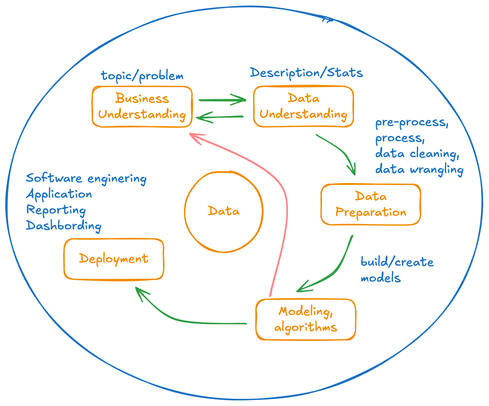
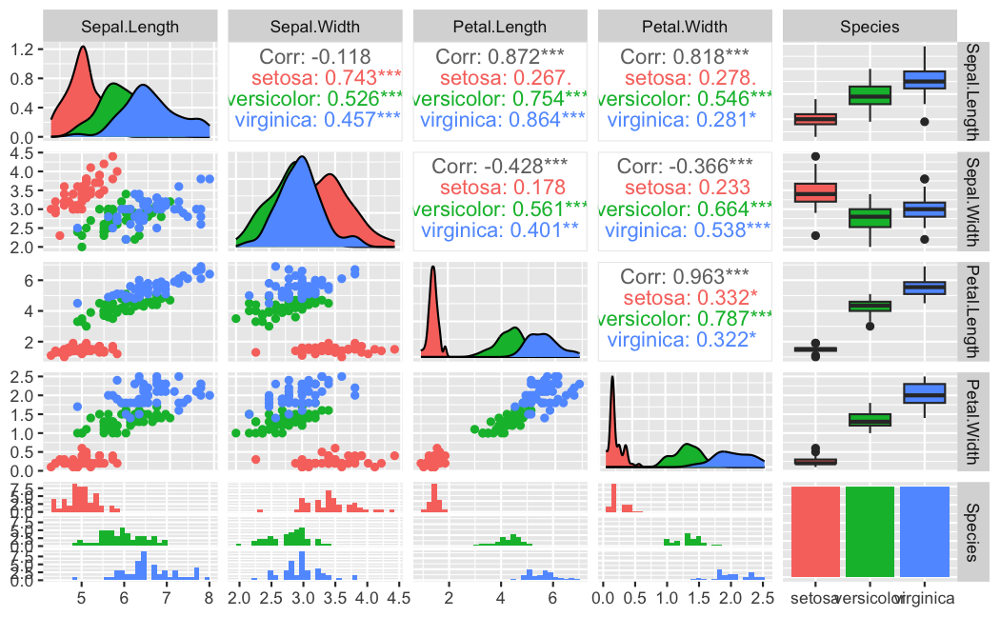

.. _part1_chap2:

***********************************************************************
Chapitre 2 : Analyse de données
***********************************************************************

Avant de fouiller des données, il faut les **comprendre**. Ce chapitre présente le
processus **CRISP-DM** et l'**analyse descriptive** (univariée et multivariée).

Objectifs
=========

À la fin de ce chapitre, vous devez pouvoir :

- Décrire les étapes du processus **CRISP-DM**
- Comprendre les éléments constitutifs d'un jeu de données (variables, types, taille)
- Mener une **analyse descriptive** univariée et multivariée
- Identifier les besoins de **nettoyage / prétraitement** des données

1. Le processus CRISP-DM
========================

**CRISP-DM** (*Cross-Industry Standard Process for Data Mining*) est une
méthodologie (cycle de vie) qui décrit les étapes d'un projet de données, de
l'objectif jusqu'au déploiement de la solution de décision :

1. **Comprendre le business** (l'objectif, la décision visée) ;
2. **Comprendre les données** ;
3. **Préparer les données** (nettoyage, transformation) ;
4. **Modéliser** le problème (choisir ou écrire les algorithmes adaptés) ;
5. **Évaluer** ;
6. **Déployer**.

   Le cycle CRISP-DM (itératif).

2. Comprendre les données
=========================

- **Variable** : une mesure / caractéristique du problème. Pour chacune : sa
  **description**, son **type** (continue/quantitative ou discrète/qualitative),
  son **unité**, ses **modalités**.
- **Taille** de la base : nombre de lignes, de colonnes.
- Sources de datasets : `UCI ML Repository <https://archive.ics.uci.edu/>`_, etc.

3. Analyse descriptive
======================

3.1. Univariée (variable par variable)
--------------------------------------

- Variable **continue** : min, max, moyenne, médiane, quantiles, écart-type.
- Variable **discrète** : compter les **modalités**.

.. code-block:: r

   # En R, un résumé rapide :
   summary(iris)

3.2. Multivariée (relations entre variables)
--------------------------------------------

- **Corrélations** entre paires de variables.
- **Visualisations** :

  - **Histogramme / densité** → évaluer la **distribution** (suit-elle une loi normale ?).

    .. figure:: img/ad-histogramme.png
       :alt: Histogramme / densité
       :align: center
       :width: 60%

  - **Boxplot / violin** → repérer les **valeurs aberrantes**.

    .. figure:: img/ad-boxplot.png
       :alt: Boxplot / violin
       :align: center
       :width: 60%

  - **Scatterplot** → repérer des **tendances** :

    .. figure:: img/ad-scatterplot.png
       :alt: Scatterplot
       :align: center
       :width: 60%

    - 2 variables (x, y) : tendance générale (linéaire, non linéaire, aléatoire, convexe/concave) ;
    - 3 variables (x, y + couleur/forme/taille) : groupes (clusters), séparabilité ;
    - 4–5 variables : tendances spécifiques (couleur + forme + taille).

  - Des représentations plus avancées (coordonnées parallèles, courbes d'Andrews, …).

4. Cas pratique : Iris
======================

Le jeu **Iris** comporte 5 variables (longueur/largeur de sépale et de pétale +
espèce). L'objectif : prédire l'espèce à partir des 4 mesures.

.. math::

   \text{espèce} = f(\text{sepal\_length}, \text{petal\_length}, \text{sepal\_width}, \text{petal\_width})

   Analyse exploratoire du jeu Iris.

5. Nettoyage et prétraitement
=============================

Avant la modélisation (CRISP étape 3), on **prépare** les données : traiter les
valeurs manquantes et aberrantes, supprimer les doublons, corriger les
incohérences, encoder/normaliser/standardiser, créer de nouvelles variables si
pertinent.

Exercice
========

Voir le :doc:`TP analyse descriptive <../part4/index>` : récupérez un jeu de
données, menez l'analyse descriptive complète et tirez des conclusions à la lumière
d'un sujet d'orientation.
