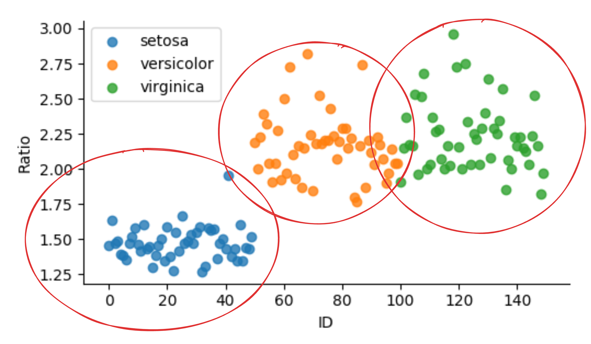
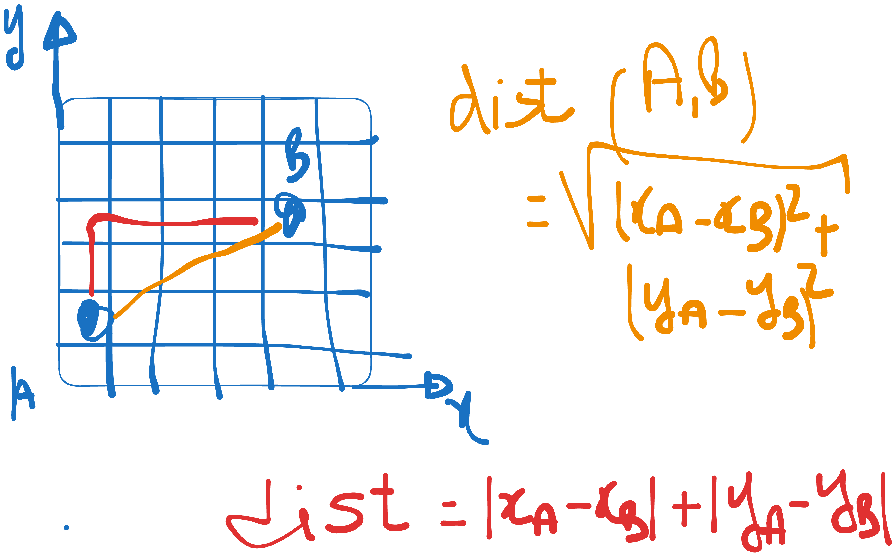
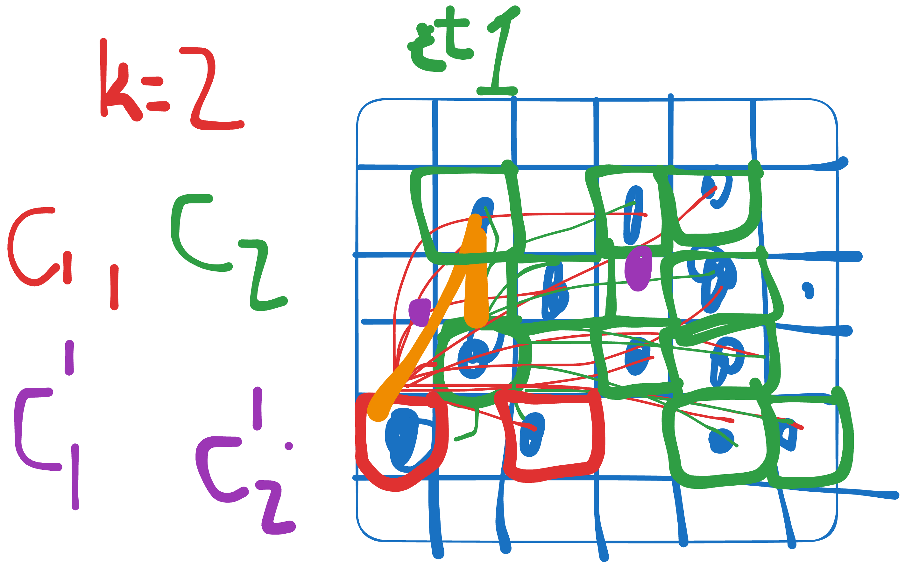
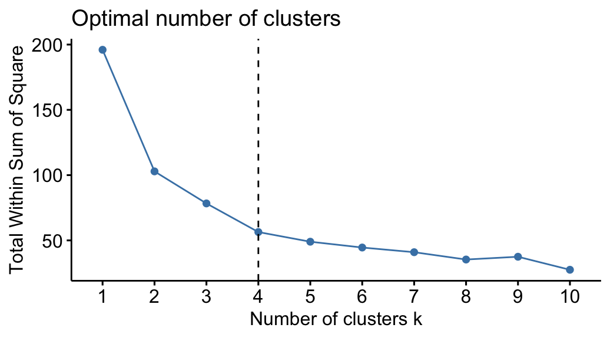

.. _part2_chap5:

***********************************************************************
Chapitre 5 : Clustering
***********************************************************************

Le **clustering** consiste à **regrouper les data-points** (observations, lignes)
*similaires* — sans étiquettes : c'est de l'apprentissage **non supervisé**.

Objectifs
=========

À la fin de ce chapitre, vous devez pouvoir :

- Définir le clustering et ses grandes catégories
- Appliquer **K-means** (et choisir K)
- Comprendre le **clustering hiérarchique** et le **dendrogramme**

1. Qu'est-ce que le clustering ?
================================

Regrouper les observations en **clusters** de sorte que les éléments d'un même
groupe se ressemblent (et diffèrent de ceux des autres groupes). L'enjeu est de
**trouver un moyen de mettre en relation** les éléments (distance, densité…).

   Le clustering regroupe les observations similaires.

**Catégories de clustering :**

- **orienté distance** : on calcule la distance qui sépare les éléments (ex. K-means) ;
- **orienté densité** : on regroupe les zones denses (ex. DBSCAN) ;
- **clustering avancé** (spectral, modèles de mélange, …).

   Clustering orienté distance.

2. K-means
==========

Étant donné une base :math:`\text{Data} = X_1, X_2, \dots, X_n`, l'algorithme :

.. code-block:: text

   1. Choisir K (le nombre de clusters)
   2. Choisir K centroïdes (par ex. K points de données comme références)
   3. Assigner chaque data-point au centroïde dont il est le plus proche
      (calcul de la distance à chaque centroïde)
   4. Recalculer chaque centroïde = moyenne des data-points de son cluster
   5. Si pas de convergence, retourner à l'étape 3

   K-means : assignation aux centroïdes puis recalcul, jusqu'à convergence.

2.1. Choisir K
--------------

- par **visualisation** ;
- en essayant plusieurs K et en évaluant la qualité des clusters — **méthode du
  coude** (*elbow*) ;
- en s'appuyant sur une autre méthode (clustering **hiérarchique** / dendrogramme).

   Méthode du coude pour choisir K.

2.2. Exploiter les résultats
----------------------------

- **Prédiction** : pour un nouveau point :math:`M(x, y)`, calculer sa distance à
  chaque centroïde et l'assigner au plus proche.
- **Domaine de couverture** d'un cluster : via les écarts-types.
- **Clustroïde** : le point *de la base* le plus proche du centroïde.

3. Clustering hiérarchique & dendrogramme
=========================================

Le **clustering hiérarchique** construit une hiérarchie de regroupements :
**agglomératif** (ascendant : on part de chaque point comme un cluster, puis on
fusionne les plus proches) ou **divisif** (descendant). Le résultat se visualise
par un **dendrogramme** : en le « coupant » à une certaine hauteur, on obtient un
nombre de clusters — ce qui aide notamment à **choisir le K** de K-means.

Exercice
========

Voir le :doc:`TP K-means <../part4/index>` : implémentez K-means sur un jeu
assigné, faites varier K et déterminez le K optimal.
