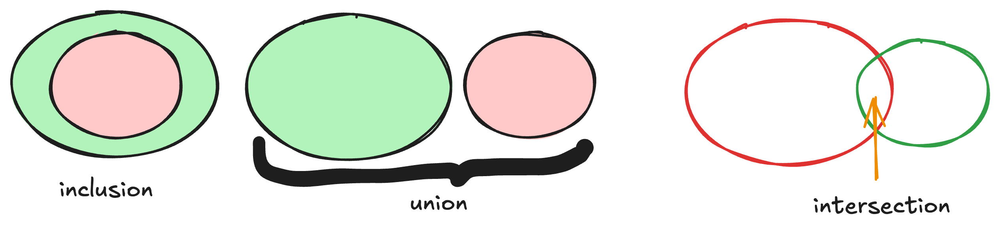
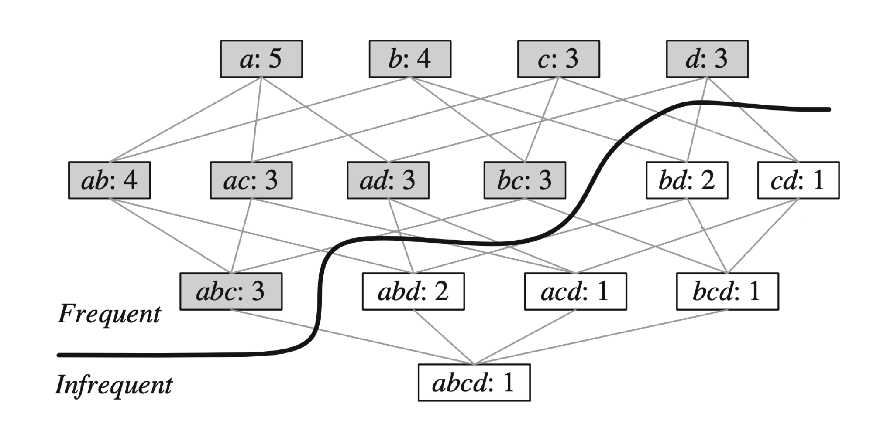

.. _part2_chap6:

***********************************************************************
Chapitre 6 : Frequent Itemset Mining
***********************************************************************

Le **Frequent Itemset Mining** (FIM) cherche les **combinaisons d'items fréquentes**
dans une base de transactions, puis en dérive des **règles d'association**.

Objectifs
=========

À la fin de ce chapitre, vous devez pouvoir :

- Formaliser le problème de FIM (couverture, support, seuil)
- Comprendre la résolution (lattice, parcours, propriété **a priori**)
- Implémenter une approche naïve → heuristique → a priori
- Générer des **règles d'association** (confiance, lift)
- Distinguer patterns **fermés** et **maximaux**

1. Motivation : le panier du supermarché
=========================================

Comprendre l'**habitude des clients** (fréquence d'achat) permet : la **gestion des
stocks**, la **recommandation** (« ceux qui achètent X achètent aussi Y »), et le
ciblage des **promotions**.

On considère le panier d'un client **sans doublons ni prix** ⇒ ce sont des
**ensembles** ⇒ on peut faire du **Frequent Itemset Mining**.

   Découvrir les combinaisons d'achats fréquentes.

**Base de transactions (TDB)** — l'ensemble des paniers (panier = transaction) :

- **horizontale** : chaque ligne = le panier d'un client ;
- **verticale** : chaque ligne = les clients ayant acheté un produit donné ;
- **dense/éparse** : lignes = clients, colonnes = produits, cellule (i, j) = 1 si le
  produit *i* est acheté par le client *j*, sinon 0.

2. Le problème de FIM
=====================

Soit un alphabet :math:`\Sigma` (produits disponibles), une transaction
:math:`T \subseteq \Sigma`, une base :math:`TDB`, et un seuil :math:`\theta`.

- **Couverture** : ``cover(P, TDB)`` = les clients ayant acheté la combinaison P.

  .. math:: \text{cover}(P, TDB) = \{\, tid_i : T_i \in TDB \ \text{et}\ P \subseteq T_i \,\}

- **Support** : le nombre de clients ayant acheté P.

  .. math:: \text{support}(P, TDB) = |\text{cover}(P, TDB)|

.. admonition:: Problème de FIM
   :class: important

   Trouver **toutes** les combinaisons :math:`P` telles que
   :math:`\text{support}(P, TDB) \ge \theta`.

3. Résolution
=============

1. Énumérer les possibilités ⇒ le **treillis** (*lattice*), niveau par niveau —
   il y a :math:`2^{|\Sigma|}` possibilités (16 pour 4 items).
2. Calculer **efficacement** le support de chaque pattern.
3. Trouver un **parcours optimal**.

4. Implémentations
==================

On veut ``fim(alphabet, TDB, theta)`` qui renvoie la liste des patterns fréquents.

**(a) Approche naïve** — DFS branchant sur tous les éléments :

.. code-block:: python

   def dfs(P, TDB, alphabet, theta):
       print(P)
       for e in alphabet:
           dfs(P | {e}, TDB, alphabet, theta)

**(b) Approche heuristique** — ordre virtuel : ne brancher que sur les **successeurs** :

.. code-block:: python

   def successeur(P, alphabet):
       return alphabet[P[-1]+1:]    # éléments après le dernier ajouté

   def dfs(P, TDB, alphabet, theta):
       print(P)
       for e in successeur(P, alphabet):
           dfs(P + [e], TDB, alphabet, theta)

**(c) Approche A priori** — heuristique + **antimonotonicité** :

.. admonition:: Propriété a priori (antimonotonicité)
   :class: tip

   - Si un pattern est fréquent, **tous ses sous-ensembles** le sont aussi.
   - Si un pattern n'est **pas** fréquent, **aucun** de ses sur-ensembles ne l'est
     (donc on **élague** la branche).

.. code-block:: python

   def dfs(P, TDB, alphabet, theta):
       print(P)
       for e in successeur(P, alphabet):
           cand = P + [e]
           if support(cand, TDB) >= theta:    # élagage a priori
               dfs(cand, TDB, alphabet, theta)

**(d) Approches avancées** (:doc:`Partie 3 <../part3/index>`) :

- **Eclat** : TDB **verticale** + a priori + intersections d'ensembles intelligentes ;
- **FP-Growth** : TDB **horizontale** + a priori + **FP-tree** pour évaluer le support ;
- **LCMv3** : encore plus d'optimisations (parmi les plus rapides).

D'autres variantes prennent en compte d'autres paramètres : **high-utility mining**
(prix + quantité), **closed/max mining** (forme compressée, avec ou sans perte).

5. Règles d'association
=======================

Trouver les patterns est utile ; en **déduire des règles** l'est davantage. Une
**règle** :math:`X \rightarrow Y` (X, Y des patterns) exprime que *Y* a des chances
d'arriver sachant que *X* est arrivé.

.. math::

   \text{confiance}(X \rightarrow Y, TDB) = \frac{\text{support}(X \cup Y)}{\text{support}(X)}

C'est une **probabilité conditionnelle**. Ex. :
:math:`\text{confiance}(\{mangue, orange\} \rightarrow \{citron\}) = 75\%` signifie
que 75 % des clients achetant mangue **et** orange achètent aussi du citron.

Autre métrique utile, le **lift** (indépendance si = 1) :

.. math::

   \text{lift}(X \rightarrow Y, TDB) = \frac{\text{support}(X \cup Y)}{\text{support}(X)\,\text{support}(Y)}

.. admonition:: Problème des règles d'association
   :class: important

   Trouver **toutes** les règles :math:`X \rightarrow Y` dont les patterns sont
   **fréquents** (support ≥ :math:`\theta`) et la **confiance** ≥ un seuil
   :math:`\beta`.

   Des patterns fréquents aux règles d'association.

6. Patterns fermés et maximaux
==============================

Les patterns fréquents sont souvent **trop nombreux** : on les **compresse**.

- **Pattern fermé** : aucun **sur-ensemble** n'a le **même support**.

  .. math:: P \text{ fermé} \iff \nexists\, P' \supset P : \text{support}(P') = \text{support}(P)

  ⇒ **compression SANS perte** (on retrouve tous les fréquents et leurs supports).

- **Pattern maximal** : aucun sur-ensemble n'est fréquent
  (:math:`\nexists\, P' \supset P` fréquent).

  ⇒ **compression AVEC perte** (on retrouve les fréquents mais pas tous leurs supports).

Exercice
========

Voir le :doc:`TP Apriori <../part4/index>` : implémentez une fonction qui reçoit une
TDB et un :math:`\theta` et renvoie les patterns fréquents (indice Python :
``itertools``, ``set.issubset``).
